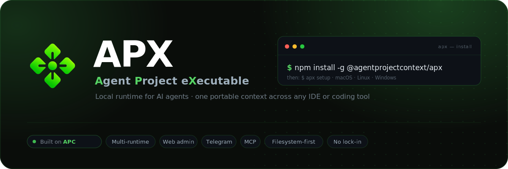

<p align="center">
  
</p>

<p align="center">
  <b>APX</b> &mdash; <b>A</b>gent <b>P</b>roject e<b>X</b>ecutable.<br>
  A local runtime, CLI and web admin for AI agents, built on the
  <a href="https://github.com/agentprojectcontext/agentprojectcontext">APC protocol</a>.
</p>

<p align="center">
  <a href="https://agentprojectcontext.github.io/apx/"></a>
  <a href="LICENSE"></a>
  
  <a href="https://github.com/agentprojectcontext/agentprojectcontext"></a>
</p>

<p align="center">
  <b><a href="https://agentprojectcontext.github.io/apx/">🌐 Visit the website</a></b> &nbsp;&middot;&nbsp;
  <a href="#quick-start">Quick start</a> &middot;
  <a href="#examples">Examples</a> &middot;
  <a href="#web-admin">Web admin</a> &middot;
  <a href="#use-cases">Use cases</a> &middot;
  <a href="https://github.com/agentprojectcontext/agentprojectcontext">APC spec</a>
</p>

> APX is the reference implementation of the [APC protocol](https://github.com/agentprojectcontext/agentprojectcontext).
> APX is to APC what a language SDK is to a protocol spec.

## What APX is

APX is a daemon + CLI that brings the APC convention to life:

- **Daemon** — a local HTTP server that manages projects, agents, sessions, and message logs
- **CLI** (`apx`) — commands for running agents, reading memory, tailing messages, managing sessions
- **Web admin** — a local web UI served by the daemon to browse projects, agents, sessions, and MCPs from the browser
- **Runtimes** — bridges to Claude Code, Codex, OpenCode, Aider
- **Engines** — direct LLM calls via Anthropic, OpenAI, Gemini, Ollama, or a mock
- **Plugins** — Telegram bot integration out of the box
- **MCP support** — each agent can expose or consume MCP servers

APX is opinionated about storage: the filesystem is the source of truth. Project definitions and curated memory live in the repo. Runtime state such as sessions, conversations, messages, and caches lives in `~/.apx/` and is never committed.

## Quick start

```bash
# 1 · Install
npm install -g apx

# 2 · Set up — interactive wizard (provider → model → channels → daemon)
apx setup

# In any directory with an AGENTS.md, register the project
apx init

# Spawn an agent with a full external runtime
apx run sofia --runtime claude-code "Review the open PRs and summarize them"

# Or a quick one-shot LLM exec
apx exec sofia "What is my role in this project?"

# Watch what's happening
apx messages tail
```

## Examples

Real commands — copy one, point it at an agent like `sofia`, and APX routes it to the right
runtime. The session and memory land in `.apc/`.

| What | Command |
|------|---------|
| Register a project | `apx init` |
| Spawn an agent (full runtime) | `apx run sofia --runtime claude-code "Review the open PRs and summarize them"` |
| Ask a quick question (one-shot) | `apx exec sofia "What is my role in this project?"` |
| Read an agent's memory | `apx memory sofia` |
| Switch runtime, same context | `apx run sofia --runtime codex "Add tests for the parser"` |
| Watch what's happening | `apx messages tail` |

## Use cases

- **Review PRs across any runtime** — point an agent at your repo; APX routes to Claude Code and falls back to Codex or OpenCode if one isn't installed. The session and its summary land in `.apc/`.
- **Operate your agents from Telegram** — talk to project agents from your phone. Identity roles gate who can do what, and every message is logged per channel for a full audit trail.
- **Memory that lives in your repo** — curated, per-agent memory is plain markdown, committed and reviewable alongside your code. No vendor database, no hidden state, no lock-in.
- **Run the same prompt across engines** — send one prompt through Anthropic, OpenAI, Gemini or a local Ollama model with `apx exec`, configured per project or globally.

## Installation

```bash
npm install -g apx
```

Requires Node.js 20+. The daemon starts automatically on first `apx` call.

## Web admin

APX ships a local **web admin** — the same runtime, in your browser. The daemon serves a
single-page app so you can browse and manage everything the CLI does without leaving the UI:

- **Projects & agents** — see registered projects, open agents, edit roles, models, and skills
- **Sessions & messages** — read past sessions and tail live activity across every channel
- **MCPs, engines & channels** — review MCP servers, configure engines, and manage Telegram/desktop

It runs entirely on your machine. Start the daemon (any `apx` call does this) and open:

```bash
apx            # ensures the daemon is up
open http://localhost:7430   # macOS — or just visit it in any browser
```

The web admin is served from `src/interfaces/web/dist` at the daemon port (`7430` by default,
override with `APX_PORT`). Nothing is sent anywhere — it talks to the local daemon only.

## Project layout

Project context — committed to the repository:

```text
project-root/
├── AGENTS.md              ← agent definitions
└── .apc/
    ├── project.json       ← project metadata + stable "id"
    ├── agents/
    │   └── <slug>.md      ← agent definition (role, model, skills…)
    ├── mcps.json          ← MCP servers available to this project
    ├── skills/            ← reusable skill prompts
    └── commands/          ← custom slash commands
```

Runtime state — local machine only, never committed:

```text
~/.apx/projects/<project-id>/
├── messages/              ← local message history
└── agents/
    ├── <slug>/
    │   ├── sessions/      ← one .md per runtime invocation
    │   └── conversations/ ← LLM conversation threads
    └── default/           ← fallback when no agent role is active
        └── sessions/
```

## Core commands

```bash
apx init [path]                          # initialize a project
apx agent list                           # list agents
apx agent add <slug> --role R --model M  # add an agent
apx memory <slug>                        # read agent memory
apx memory <slug> --append "<note>"      # append to memory

apx run   <slug> --runtime claude-code "<prompt>"   # full runtime session
apx run   <slug> --runtime cursor-agent "<prompt>"  # Cursor Agent runtime
apx exec  <slug> "<prompt>"                          # quick LLM call

apx session list <slug>                  # list past sessions
apx messages tail                        # last 50 messages, all channels
apx messages chat --channel telegram     # chat view with user/agent/system type
apx messages tail --channel runtime      # only agent invocations
```

## Message channels

Activity belongs to APX runtime state, not `.apc/`. Message storage is local to APX, under
`~/.apx/`:

JSONL messages include `type` (`user`, `agent`, `tool`, or `system`) plus `actor_id`, so chat views
can distinguish Telegram users from APX agents and future subagents.

| Channel | What it captures |
|---------|-----------------|
| `runtime` | `apx run` invocations (prompt in, response out) |
| `a2a` | Agent-to-agent calls made from within a session |
| `telegram` | Telegram bot messages (stored globally in `~/.apx/messages/telegram/`) |
| `exec` | Quick `apx exec` calls |

## Runtimes

| Runtime | Description |
|---------|-------------|
| `claude-code` | Spawns Claude Code CLI with the agent's system prompt injected |
| `codex` | OpenAI Codex CLI via non-interactive `codex exec --sandbox workspace-write --skip-git-repo-check` |
| `opencode` | OpenCode CLI |
| `aider` | Aider CLI |

Global APX skill installation also writes named helper skills for `codex-cli`, `claude-code`,
`opencode-cli`, and `openrouter`. They are intentionally narrow and should activate only when those
tools/providers are explicitly mentioned.

## Engines (for `apx exec`)

Configured in `~/.apx/config.json`:

```json
{
  "engines": {
    "anthropic": { "api_key": "sk-ant-..." },
    "openai":    { "api_key": "sk-..." },
    "ollama":    { "base_url": "http://localhost:11434" },
    "gemini":    { "api_key": "..." }
  }
}
```

## Architecture

<p align="center">
  
</p>

## APC protocol

APX implements the [APC specification](https://github.com/agentprojectcontext/agentprojectcontext). The spec defines the on-disk layout; APX provides the tooling to use it.

## License

MIT
