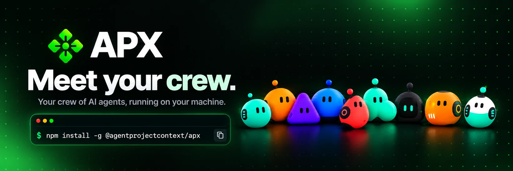
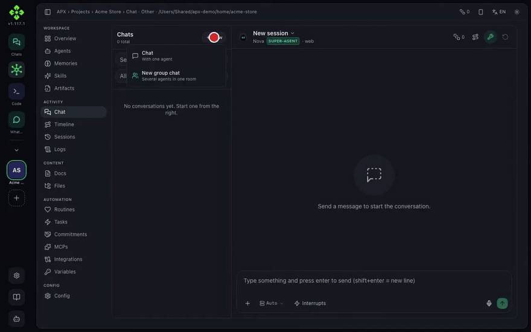
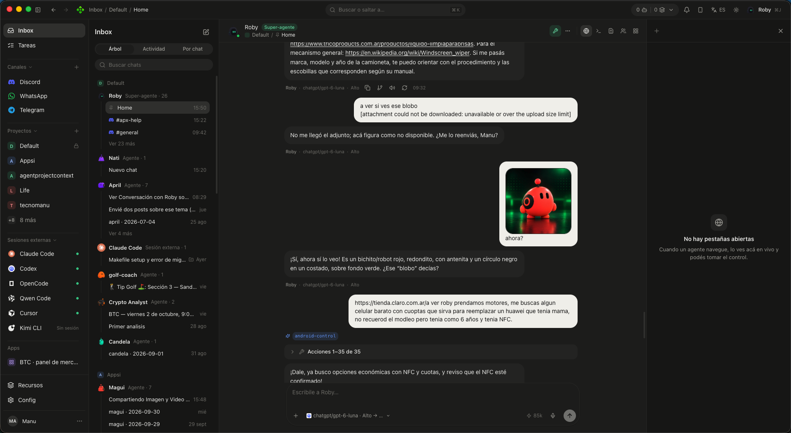
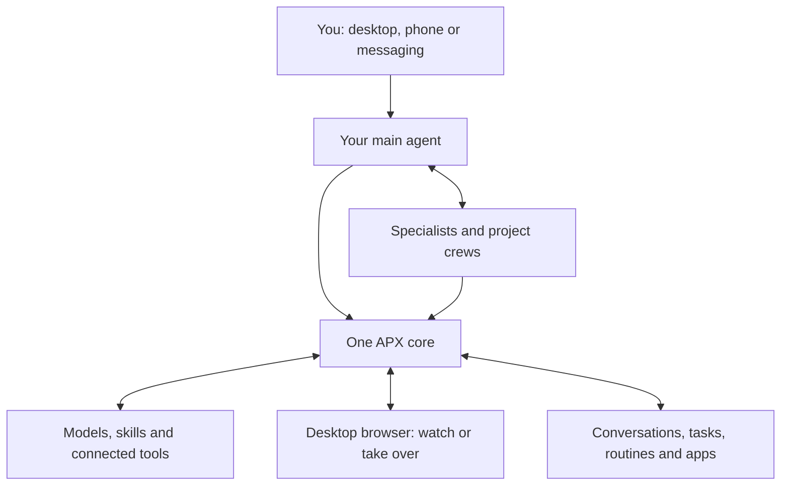

<p align="center">
  
</p>

<h3 align="center">Meet your crew.</h3>

<p align="center">
  <b>APX is an open-source Agent OS: your own team of AI agents, running on your machine.</b><br>
  Give them roles, memory and tools. Talk to them, let them work together, and follow what they do.<br>
  Research, writing, everyday plans, business operations or code — build a crew around your life and work.
</p>

<p align="center">
  <a href="https://agentprojectcontext.github.io/apx/"></a>
  <a href="LICENSE"></a>
  
  <a href="https://discord.gg/vxdZuT5WuE"></a>
</p>

<p align="center">
  <b><a href="https://agentprojectcontext.github.io/apx/">See APX working →</a></b> ·
  <a href="#quick-start">Install v1</a> · <a href="#coming-next-apx-v2">V2 preview</a> ·
  <a href="README_ES.md">Español</a> · <a href="https://discord.gg/vxdZuT5WuE">Discord</a>
</p>

## See your crew in action

<p align="center">
  <a href="https://agentprojectcontext.github.io/apx/">
    
  </a><br>
  <sub>A real recording of APX v1 running a demo crew. <a href="https://agentprojectcontext.github.io/apx/">Watch more recorded workflows on the website.</a></sub>
</p>

Each agent gets a **blobo** — its own face — alongside a role, memory, skills and tools.
Mention one in a conversation and it can pick up the work or ask another agent for help.
The faces make your crew easy to recognize; the recorded workflows show what it actually does.

## What you can do

- **Keep a crew for each part of your work.** A researcher, a writer, an organizer or a coding agent: choose the roles you need and group them by project.
- **Give work to the team.** Start a group chat, mention an agent in a task, and follow its reply. Agents can ask each other for help.
- **Put recurring work on a schedule.** Daily briefings, reports and check-ins can run as routines while APX stays running.
- **Reach the same crew from different places.** Use the web panel, Telegram, WhatsApp or your phone; your agents keep their roles and access to their tools.
- **See the work as it happens.** Conversations show agent actions, and the panel brings chats, tasks, routines and code sessions together.
- **Bring your models and tools.** Connect model providers, local Ollama models, skills and MCP servers. For coding work, delegate to Claude Code, Codex or another supported CLI.

APX runs on your machine. Connected cloud models and services receive the data needed for the requests you send them; local operation does not mean every model runs offline.

## Why APX?

The reason to try APX is the **crew workflow**: recognizable agents, roles organized around your projects,
shared conversations, delegated work, tasks and routines in one place. A project can be a business, a creative
project, a personal workspace or a codebase. You do not need a Git repository to start using APX.

If you already use OpenClaw or another agent app, local execution, markdown files and messaging integrations
alone are not a reason to switch. Compare the experience: does APX make your particular team easier to organize,
work with and follow? [Watch a real workflow](https://agentprojectcontext.github.io/apx/) and try it with one task
that matters to you.

For code projects, agent definitions, skills and shared project context can travel with the repository.
Conversations, sessions, credentials and private runtime memory stay outside it.

## Quick start

**This repository and these installation commands are for APX v1. Requires Node.js 22+ on macOS, Linux or Windows.**

```bash
npm install -g @agentprojectcontext/apx
apx setup
```

The setup wizard helps you choose a provider, a model and your channels, starts APX, and prints your panel address.
Open **[http://localhost:7430](http://localhost:7430)** in your browser.

Start with one agent and one real task. Add specialists and routines as you need them.
Cloud providers require their own access or credentials; local models require a configured local provider.

Prefer the terminal? From a project folder:

```bash
apx init
apx agent list
# Replace <agent> with an agent listed above.
apx exec <agent> "Help me plan the next steps for this project"
apx run <agent> --runtime claude-code "Review this project and suggest improvements"
apx run <agent> --runtime codex "Add tests for the parser"
```

Coding commands require the selected external CLI to be installed and authenticated.

## On your phone

The panel fits your phone too. `apx panel share` gives you a network address;
`apx panel tailscale on` lets you reach it through your tailnet. Open the panel on your phone and add it to your home screen.

There is also a native **Android app**, with notifications, a floating mascot and Android Auto:

- [Download the Android APK](https://github.com/agentprojectcontext/apx/releases/download/android-latest/apx.apk).
- Or connect your phone by USB and run `apx android install`.
- [Read the installation guide](https://agentprojectcontext.github.io/apx/docs/surfaces/install-android/).

The Android app installs from a file, outside Google Play. On iPhone, use the web panel.
USB access lasts while the cable is connected; LAN access stays within your network; Tailscale connects devices on your tailnet.

## Coming next: APX V2

**V2 is in development.** It takes APX further as a standalone application for your crew.
The v1 commands above install the current application, not V2.

<p align="center">
  <br>
  <sub>Real V2 interface running a scripted demo with fictional data: agent-to-agent delegation, an interactive widget and a live browser page. <a href="assets/apx-v2-preview-light.png">View the light-mode capture.</a></sub>
</p>


| Experience | APX v1 today | Direction of V2 |
|---|---|---|
| Your main agent | A local assistant reached through the panel and channels | A central place to work with the main agent and specialists across personal and project work |
| Conversations | Chats, group conversations and code sessions | A unified inbox organized by project, agent and channel, alongside external coding sessions |
| Working on the web | Browser tools through integrations | An embedded desktop browser: watch agents navigate and take over yourself |
| Following the work | Agent actions, tasks and routines in the panel | Conversations, delegated work, tools, files and apps brought together around the active workspace |
| Devices | Web panel, messaging, desktop and Android surfaces | Desktop and phone clients connected to the same core, including a core hosted on your own server |

These are the direction and current development experience, not a promise that every v1 feature has already reached parity.

### How V2 works


```mermaid
flowchart TB
    You[You: desktop, phone or messaging] --> Main[Your main agent]
    Main <--> Crew[Specialists and project crews]
    Main --> Core[One APX core]
    Crew --> Core
    Core <--> Tools[Models, skills and connected tools]
    Core <--> Browser[Desktop browser: watch or take over]
    Core <--> Work[Conversations, tasks, routines and apps]
```

One core owns the work and history; the app, phone and messaging channels connect to it.
Your main agent can work directly or delegate to a specialist. The desktop supplies its browser,
where you can see the page and take control. This keeps the crew together as you move between devices.

Follow [the website](https://agentprojectcontext.github.io/apx/) and [Discord](https://discord.gg/vxdZuT5WuE)
for V2 progress and release news.

## Documentation and community

- [Website and recorded demos](https://agentprojectcontext.github.io/apx/)
- [User documentation](https://agentprojectcontext.github.io/apx/docs/)
- [Discord community](https://discord.gg/vxdZuT5WuE)
- [Report a bug or suggest an improvement](https://github.com/agentprojectcontext/apx/issues)

<details>
<summary>Technical reference: v1 channels and coding runtimes</summary>

## Message channels

Activity belongs to APX runtime state, not `.apc/`. Message storage is local to APX, under
`~/.apx/`:

JSONL messages include `type` (`user`, `agent`, `tool`, or `system`) plus `actor_id`, so chat views
can distinguish Telegram users from APX agents and future subagents.

A **channel** is the surface a turn arrived on. The canonical list lives in
`src/core/constants/channels.js`; `voice` is a *mode*, not a channel.

| Channel | What it captures |
|---------|-----------------|
| `cli` | `apx exec` / `apx run` from the terminal |
| `telegram` | Telegram bot messages |
| `api` | Direct daemon HTTP calls |
| `web` | The admin panel's main chat |
| `web_sidebar` | The panel's side assistant |
| `web_code` | The panel's coding surface |
| `code` | `apx code` sessions |
| `deck` | The tablet/phone dashboard |
| `desktop` | The floating voice capsule (always voice mode) |
| `routine` | Scheduled routine runs |

## Runtimes

| Runtime | Description |
|---------|-------------|
| `claude-code` | Spawns Claude Code CLI with the agent's system prompt injected |
| `codex` | OpenAI Codex CLI via non-interactive `codex exec --sandbox workspace-write --skip-git-repo-check` |
| `opencode` | OpenCode CLI |
| `aider` | Aider CLI |
| `cursor-agent` | Cursor's headless agent |
| `gemini-cli` | Google Gemini CLI |
| `qwen-code` | Qwen Code CLI |
| `antigravity` | Antigravity CLI |

Global APX skill installation also writes named helper skills for `codex-cli`, `claude-code`,
`opencode-cli`, and `openrouter`. They are intentionally narrow and should activate only when those
tools/providers are explicitly mentioned.


</details>

## Where APX started

APX began as a way to make **APC — Agent Project Context** work in practice: portable agent definitions,
skills and project instructions in `AGENTS.md` and `.apc/`. It grew into an application with its own crew,
conversations, tasks, routines, channels and interfaces. **APX is the product you use today; APC is part of its origin and project-context foundation.**

You do not need to learn the protocol to use APX. If you want the technical background,
read the [APC specification](https://github.com/agentprojectcontext/agentprojectcontext).

For contributors, start with [AGENTS.md](AGENTS.md). APX v1 has a local daemon, a CLI, a web panel and bridges to external tools.
Project context can live in the project folder; runtime state lives under `~/.apx/`, outside the repository.

## License

[MIT](LICENSE)
