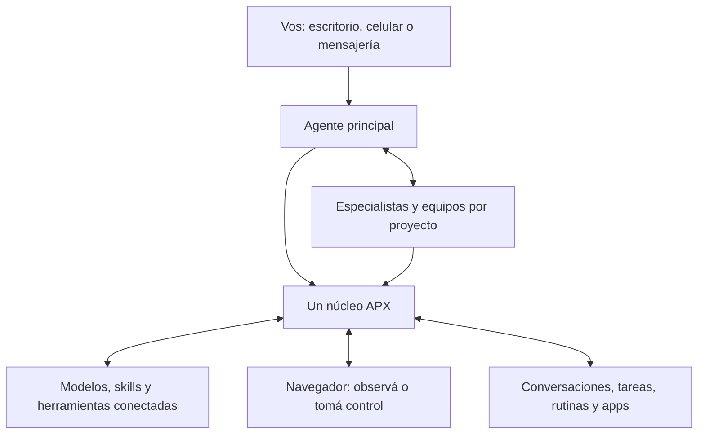

<p align="center">
  
</p>

<h3 align="center">Conocé a tu crew.</h3>

**APX es un Agent OS open source: tu propio equipo de agentes de IA, funcionando en tu máquina.**
Dales roles, memoria y herramientas. Hablales, dejá que trabajen juntos y seguí lo que hacen.
Investigación, escritura, organización personal, negocios o código: armá un equipo alrededor de tu vida y trabajo.

**[Mirá APX funcionando →](https://agentprojectcontext.github.io/apx/)** · [English](README.md) · [Discord](https://discord.gg/vxdZuT5WuE)

## Tu equipo en acción

<p align="center">
  <a href="https://agentprojectcontext.github.io/apx/">
    
  </a><br>
  <sub>APX v1 con un equipo de demostración. <a href="https://agentprojectcontext.github.io/apx/">Más flujos grabados en la web.</a></sub>
</p>

Cada agente tiene un **blobo**, su propia cara, además de rol, memoria, skills y herramientas.
Mencionalo en una conversación: puede tomar el trabajo o pedir ayuda a otro agente.

## Qué podés hacer

- **Organizar tu equipo por proyecto.** Investigador, redactor, organizador o agente de código: elegí los roles que necesitás.
- **Delegar trabajo.** Iniciá chats grupales, mencioná agentes en tareas y seguí sus respuestas. Pueden consultarse entre ellos.
- **Programar rutinas.** Resúmenes diarios, reportes y revisiones mientras APX permanece funcionando.
- **Hablar desde distintos lugares.** Panel web, Telegram, WhatsApp y celular; los agentes conservan sus roles y herramientas.
- **Ver las acciones.** Conversaciones, tareas, rutinas y sesiones de código reunidas en el panel.
- **Traer modelos y herramientas.** Proveedores de IA, modelos locales con Ollama, skills y servidores MCP. Para código, Claude Code, Codex y otras CLI compatibles.

APX corre en tu máquina. Los modelos y servicios externos reciben los datos necesarios para las solicitudes que les enviás; eso no significa que todos los modelos funcionen sin internet.

## ¿Por qué APX?

La propuesta es **trabajar con un equipo**: agentes reconocibles, roles por proyecto, conversaciones compartidas,
delegación, tareas y rutinas en un mismo lugar. Un proyecto puede ser un negocio, un espacio creativo, personal o una base de código.
No necesitás un repositorio Git para empezar.

Si ya usás OpenClaw u otra aplicación de agentes, ejecución local, archivos markdown y mensajería no bastan como motivo para cambiar.
Compará la experiencia: ¿APX facilita organizar, usar y seguir tu equipo? [Mirá un flujo real](https://agentprojectcontext.github.io/apx/) y probalo con una tarea importante para vos.

En proyectos de código, definiciones de agentes, skills y contexto compartido pueden viajar con el repositorio.
Conversaciones, sesiones, credenciales y memoria privada quedan fuera.

## Empezar

**Este repositorio y estos comandos corresponden a APX v1. Requiere Node.js 22+ en macOS, Linux o Windows.**

```bash
npm install -g @agentprojectcontext/apx
apx setup
```

El asistente configura proveedor, modelo y canales, inicia APX y muestra la dirección del panel.
Abrí **[http://localhost:7430](http://localhost:7430)** en tu navegador.
Empezá con un agente y una tarea real; sumá especialistas y rutinas cuando los necesites.
Los proveedores externos requieren acceso o credenciales propios; los modelos locales requieren un proveedor local configurado.

Desde una carpeta de proyecto, también podés usar la terminal:

```bash
apx init
apx agent list
# Replace <agent> with an agent listed above.
apx exec <agent> "Ayudame a planificar los próximos pasos de este proyecto"
apx run <agent> --runtime claude-code "Revisá este proyecto y sugerí mejoras"
apx run <agent> --runtime codex "Agregá tests para el parser"
```

Los comandos de código requieren la CLI elegida instalada y autenticada.

## En tu celular

`apx panel share` muestra una dirección para tu red; `apx panel tailscale on` permite acceder desde tu tailnet.
Abrí el panel en tu celular y agregalo a la pantalla de inicio.

También existe una **app Android**, con notificaciones, mascota flotante y Android Auto:

- [Descargar APK](https://github.com/agentprojectcontext/apx/releases/download/android-latest/apx.apk).
- O conectá el celular por USB y ejecutá `apx android install`.
- [Guía de instalación](https://agentprojectcontext.github.io/apx/docs/surfaces/install-android/).

Se instala desde archivo, fuera de Google Play. En iPhone usá el panel web.
El acceso USB depende del cable; LAN funciona dentro de tu red; Tailscale conecta dispositivos de tu tailnet.

## Lo próximo: APX V2

**V2 está en desarrollo.** Lleva APX más lejos como aplicación independiente para tu equipo.
Los comandos anteriores instalan la versión actual, no V2.

<p align="center">
  <br>
  <sub>Interfaz V2 real con una demo guionada y datos ficticios: delegación entre agentes, widget interactivo y página abierta en el navegador. <a href="assets/apx-v2-preview-light.png">Ver captura en modo claro.</a></sub>
</p>

| Experiencia | APX v1 actual | Dirección de V2 |
|---|---|---|
| Agente principal | Asistente local desde panel y canales | Espacio central para trabajar con agente principal y especialistas en tareas personales y proyectos |
| Conversaciones | Chats, grupos y sesiones de código | Inbox unificado por proyecto, agente y canal, junto a sesiones externas de código |
| Navegación web | Herramientas mediante integraciones | Navegador integrado en escritorio: observá los agentes y tomá control |
| Seguimiento | Acciones, tareas y rutinas en panel | Conversaciones, delegaciones, herramientas, archivos y apps alrededor del espacio activo |
| Dispositivos | Panel web, mensajería, escritorio y Android | Clientes de escritorio y celular conectados al mismo núcleo, incluso alojado en servidor propio |

Esto describe dirección y experiencia de desarrollo; no promete que todas las funciones v1 ya tengan equivalencia en V2.

### Cómo funciona V2



Un núcleo conserva trabajo e historial; aplicación, celular y mensajería se conectan a él.
El agente principal trabaja directamente o delega a especialistas. El escritorio aporta el navegador,
donde podés observar y tomar control. El equipo permanece conectado al cambiar de dispositivo.

Seguí [la web](https://agentprojectcontext.github.io/apx/) y [Discord](https://discord.gg/vxdZuT5WuE) para avances y novedades de V2.

## Documentación y comunidad

- [Website y demos grabadas](https://agentprojectcontext.github.io/apx/)
- [Documentación](https://agentprojectcontext.github.io/apx/docs/)
- [Discord](https://discord.gg/vxdZuT5WuE)
- [Reportar errores o sugerir mejoras](https://github.com/agentprojectcontext/apx/issues)

## Cómo empezó APX

APX nació para llevar **APC — Agent Project Context** a la práctica: definiciones de agentes,
skills e instrucciones portables en `AGENTS.md` y `.apc/`. Creció hasta convertirse en una aplicación con equipo,
conversaciones, tareas, rutinas, canales e interfaces propios.
**APX es el producto actual; APC forma parte de su origen y base de contexto por proyecto.**

No necesitás aprender el protocolo para usar APX. Si te interesa el trasfondo técnico,
consultá [la especificación APC](https://github.com/agentprojectcontext/agentprojectcontext).

Para contribuir, empezá por [AGENTS.md](AGENTS.md). APX v1 tiene daemon local, CLI, panel web y puentes hacia herramientas externas.
El contexto compartido puede vivir en la carpeta del proyecto; el estado de ejecución queda en `~/.apx/`, fuera del repositorio.

## Licencia

[MIT](LICENSE)
