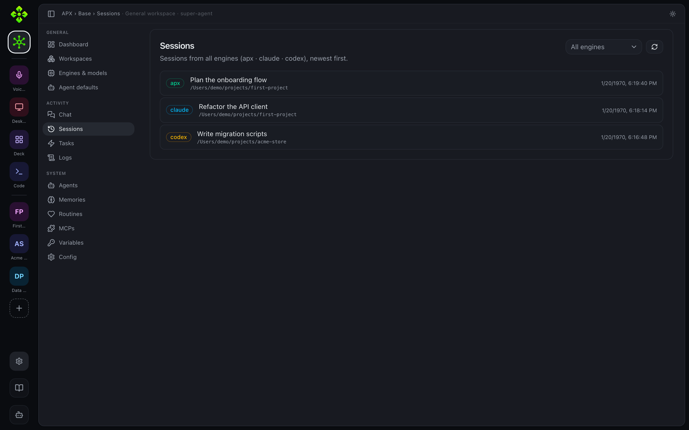

import { Steps, Tabs, TabItem, Aside, FileTree, Badge } from '@astrojs/starlight/components';
import Screenshot from '../../../../components/Screenshot.astro';
import Terminal from '../../../../components/Terminal.astro';

El panel de administración web es la UI de APX basada en navegador. Corre enteramente en tu navegador,
habla con el daemon sobre su API HTTP y no requiere ningún servidor público. Cualquier navegador
en la misma máquina — o en la misma LAN tras la vinculación — puede usarlo.


## Abrir en la máquina local

El daemon sirve el panel compilado en `http://127.0.0.1:7430/`. Arrancá el daemon
y abrí esa URL:

```bash
apx status          # boots the daemon if it isn't running yet
# then open http://127.0.0.1:7430 in your browser
```

En la primera carga el panel obtiene su token de autenticación automáticamente desde
`/admin/web-token` (endpoint solo loopback). No necesitás copiar un token
a mano cuando lo abrís desde la misma máquina.

<Aside type="note">
  Si el panel muestra "The admin panel hasn't been built on this install", ejecutá
  `node scripts/build-web.js` (o `npm run build:web`) desde la raíz del repo para
  compilar el bundle en `src/interfaces/web/dist/`.
</Aside>

## Abrir desde otro dispositivo (vinculación por LAN)

Para abrir el panel en tu teléfono u otra computadora en la misma LAN, usá
`apx pair web`. El comando imprime un código QR y una URL directa:

```bash
apx pair web
# Prints:
#   http://192.168.1.42:7430/#token=<token>
#   [QR code for scanning with a phone camera]
```

Escaneá el QR con la cámara de tu teléfono (no hace falta ninguna app) o compartí la URL. El
fragmento `#token=…` lleva el token bearer — el panel lo usa automáticamente.

<Terminal command="apx pair web" caption="apx pair web — código QR y enlace de LAN impresos en la terminal">
{`  APX pairing (web)  ·  expires in 90s

    █▀▀▀▀▀█ ▀▄█▀▄ █▀▀▀▀▀█
    █ ███ █ ▀█▄▀  █ ███ █
    █ ▀▀▀ █ █▄▀█▀ █ ▀▀▀ █
    ▀▀▀▀▀▀▀ █ ▀ █ ▀▀▀▀▀▀▀
    ██▀▄ ▀▀▄▀█▄▀▄█▀ ▄█▀▄█
    ▀ ▀▀▀▀▀ █▄▀ ▄██▀▀▄ ▄▀
    █▀▀▀▀▀█ ▄▀█▄▀▀█▄▀ █▄█
    █ ███ █ ▀█▄ ▀▄█▀▄▀▀▀▀
    █ ▀▀▀ █ ▀▄█▀█ ▄▀▄█▄ ▄
    ▀▀▀▀▀▀▀ ▀▀ ▀▀▀▀ ▀ ▀▀▀

  escaneá con la cámara del teléfono — abre la web ya vinculada
  link: http://192.168.1.42:7430/#token=8f3a…d10c
  code: pr_7QF2K  (o pegalo en la pantalla de vinculación de la web)`}
</Terminal>

Para ver todos los clientes vinculados actualmente o revocar uno:

```bash
apx pair list
apx pair revoke <id>
```

<Aside type="caution">
  El daemon se enlaza a `127.0.0.1` por defecto. Para el acceso por LAN tenés que optar
  por entrar: `apx config set remote.bind 0.0.0.0` y luego reiniciá el daemon. Este es un
  paso explícito para que no expongas el daemon accidentalmente en una red compartida
  sin la intención de hacerlo.
</Aside>

## Compilar el bundle web

El panel es una app de Vite + React + TypeScript bajo `src/interfaces/web/`. La
salida compilada cae en `src/interfaces/web/dist/` y es servida por el daemon.

```bash
# Build once (from repo root)
node scripts/build-web.js

# Or rebuild manually
cd src/interfaces/web
pnpm install
pnpm build

# Development with hot reload (proxies API calls to :7430)
pnpm dev
```

El script npm `build:web` y el hook `prepack` llaman ambos a
`node scripts/build-web.js`, así que un `npm install -g .` global siempre envía un
bundle fresco. Configurá `APX_SKIP_WEB_BUILD=1` para saltearlo durante flujos de dev que
no tocan la UI.

## Modelo de navegación

El panel tiene dos niveles de navegación:

- **Base** (`/p/0/…`) — el espacio global del daemon: workspaces, modelos, sesiones,
  logs y configuración global. El chat en Base habla con el super-agente.
- **Proyecto** (`/p/:pid/…`) — un único workspace de proyecto: agentes, chat, tareas,
  rutinas, MCPs, memorias y configuración.

Un riel izquierdo muestra todos los proyectos registrados más accesos directos a los módulos (Voces, Desktop,
Deck, Code). Debajo del riel hay un botón **Roby** que abre una hoja flotante de chat
conectada al super-agente.


## Workspace de proyecto

Abrir un proyecto te lleva a su **Resumen** — un "mission control" con tarjetas
de conteo en vivo (agentes, tareas abiertas, rutinas activas, artifacts), una
franja de flujo de tareas desglosada por estado, el roster de agentes
(orquestadores vs. especialistas) y las tareas abiertas más recientes. Cada
pestaña de abajo mapea a un namespace de la API del daemon.

<Screenshot
  surface="web"
  caption="Resumen del proyecto — tarjetas de conteo, franja de flujo de tareas y roster de agentes"
  hint="apx web, luego abrí cualquier proyecto (su pestaña de aterrizaje)" />

### Chat

La pestaña **Chat** habla con el super-agente (Roby) y con cada agente del proyecto. La
barra lateral es channel-first, agrupada como **Web, Telegram, Desktop, Voice, Agent ↔
Agent, Schedule, Other** — en ese orden. Además de tus propias conversaciones web,
también muestra los hilos por día del super-agente de cualquier otro canal (Telegram,
Desktop, Deck), así una conversación que pasó por Telegram queda visible y se puede
continuar desde la web.

El botón **"+ New"** abre un selector de agente (super-agente o cualquier agente del
proyecto) e inicia una sesión nueva que recién se materializa bajo el grupo Web cuando
mandás el primer mensaje. Cada conversación abierta tiene una acción **"New session"**
(reinicia en el lugar) y una acción **"Delete"** (detrás de un diálogo de confirmación)
que elimina permanentemente el archivo de conversación o el hilo del canal.


### Tasks

La pestaña **Tasks** es el backlog del proyecto. Además de los campos clásicos de
id/título/tags/fecha de vencimiento/agente asignado, las tareas ahora llevan un
**estado de flujo de trabajo** — `pending`, `running`, `in_review` o `blocked` mientras
están abiertas, y `done`/`dropped` una vez cerradas — mostrado con un ícono y color de
estado. Al abrir una tarea aparece un **panel de detalle** con estado y cuerpo editables,
y un enlace **"View thread"** cuando la tarea está vinculada a un hilo de chat. La lista
tiene paginación de servidor (ver más abajo) y se puede filtrar por estado (open / done
/ dropped).


### Routines

La pestaña **Routines** programa trabajo recurrente — un prompt del super-agente, un comando de
shell, un mensaje de Telegram, o un heartbeat — en una expresión cron.


### MCPs

La pestaña **MCPs** lista los servidores Model Context Protocol disponibles para el
proyecto en los tres scopes (shared, runtime, global), con un panel de logs en vivo.
Los valores de header/config en el editor de MCP soportan el selector de tokens de
variables — mirá [Variables](#variables) más abajo.


### Memories

La pestaña **Memories** edita el `.apc/memory.md` del proyecto y la memoria de runtime
de cada agente, el contexto de larga vida que los agentes leen en cada turno.


### Skills

La pestaña **Skills** incrusta el mismo gestor de skills que se usa en Settings (mirá
[Skills](/apx/docs/es/capabilities/skills/)), fijado al scope de este proyecto — habilitar,
deshabilitar, agregar e inspeccionar skills sin salir del proyecto.

### Structure <Badge text="Proyectos de empresa" variant="note" />

Para proyectos con `kind: "company"`, aparece una pestaña **Structure** para gestionar
el modelo organizacional detrás de la asignación de agentes: **Areas** (por ejemplo
"Engineering", "Sales") y **Roles** dentro o fuera de un área. Las áreas y roles se
pueden crear, editar y eliminar acá, y están respaldados por `.apc/organization.json`.
Los mismos diálogos de creación rápida son accesibles desde los selectores de Area/Role
del editor de agentes.

<Screenshot
  surface="web"
  caption="Pestaña Structure — Areas y Roles para un proyecto de tipo empresa"
  hint="apx web, luego abrí un proyecto de empresa → Structure" />

### Docs y Files

Dos pestañas navegan los archivos del proyecto con el mismo componente visor:

- **Docs** — editable. Enraizado en la carpeta de docs configurada del proyecto
  (`docs.root`, default `docs/`). Soporta crear, editar (un editor de markdown split
  sin dependencias con preview en vivo) y eliminar archivos.
- **Files** — de solo lectura. Navega todo el árbol del proyecto. Consciente del tipo:
  Markdown se renderiza, el código se muestra con números de línea, las imágenes se
  previsualizan inline.

<Screenshot
  surface="web"
  caption="Pestaña Docs — editor de markdown split con preview en vivo"
  hint="apx web, luego abrí un proyecto → Docs → creá o abrí un archivo" />

### Artifacts

La pestaña **Artifacts** lista los artifacts guardados bajo `<project>/artifacts/` —
la misma lista que usa el panel lateral del módulo Code, ahora accesible desde la
navegación propia del proyecto. **Run** y **Edit** delegan al [módulo Code](#code)
para que puedas pasar argumentos (por ejemplo una URL) en la terminal o editar el
archivo directamente, en lugar de ejecutar sin cabeza en el lugar.

### Config

La pestaña **Config** muestra la configuración efectiva del proyecto fusionada desde los
archivos `.apc/` del proyecto y los defaults globales.


### Variables

La pestaña **Variables** (`vars`) gestiona valores secretos/de config nombrados y
enmascarados, en scope de proyecto o global (por ejemplo `MY_API_KEY`). Los valores
están ocultos por default con un toggle de revelar por fila y uno global. Donde sea
que un valor pueda referenciar una variable — por ejemplo los headers de un servidor
MCP — un **selector de tokens** (el botón "+" junto al campo) te deja buscar e
insertar `${var.NAME}`, renderizado inline como un badge `$NAME` para que la
referencia se lea como parte de la línea en vez de un string de template crudo.

<Screenshot
  surface="web"
  caption="Pestaña Variables — valores enmascarados con el selector de tokens usado para referenciarlos en otro lado"
  hint="apx web, luego abrí un proyecto → Variables, y MCPs → campo de header" />

## Módulos del riel

### Projects

La pestaña Projects (Base → Workspaces) lista todos los proyectos registrados como tarjetas.
Hacé clic en una tarjeta para entrar a ese proyecto. El botón "New project" abre un diálogo
inline (`?action=add-project`).


### Agents

Cada proyecto tiene una pestaña Agents. Podés crear, editar y eliminar agentes; ver
y editar el `memory.md` de cada agente; y asignar skills. En el espacio Base la
pestaña Agents muestra la configuración del super-agente (resumen de solo lectura).


Abrí un agente para inspeccionar su memoria, skills, herramientas, sub-agentes y grafo cerebral.
El editor también define un **emoji** (que se muestra junto al agente en toda la UI, incluido
el roster del Resumen), un nivel de **autonomy** — un selector de tres opciones para los mismos
modos de permiso que la CLI/config (`total`, `automatico`, `permiso`, etiquetados Total / Auto /
Permission) — y, para proyectos de tipo empresa, un **Area** y **Role** tomados de
[Structure](#structure), con botones de creación rápida junto a cada selector.


### Sessions

La pestaña Base **Sessions** (`/p/0/sessions`) lista todas las sesiones grabadas a través de
los engines. Un buscador (coincidencia por título por default, con un toggle "Deep" para
escanear el contenido de la transcripción) reutiliza la misma lógica de matching que
`apx session find`, más un filtro de engine y un botón Clear. Cada fila expone cuatro
acciones: copiar el comando `apx session resume <id> --continue`, pedirle al asistente que
continúe esa sesión desde una burbuja de chat rápido, abrir la carpeta de trabajo de la
sesión, y copiar su ruta.



### Voices

El módulo Voices (`/m/voice`) configura TTS y STT globalmente. Muestra el
estado en vivo de cada motor TTS configurado (Piper, ElevenLabs, OpenAI, Gemini,
mock), te deja elegir un default o un modo de cadena-con-fallback, reordenar la cadena,
configurar credenciales por motor y correr una reproducción de prueba en vivo. La sección STT
configura el modelo y el idioma de Whisper para la entrada de micrófono.

Mirá [Voz](/apx/docs/es/surfaces/voice/) para la referencia completa de la CLI.


### Desktop

El módulo Desktop (`/m/desktop`) muestra si la ventana flotante de Electron está
corriendo (clientes WebSocket conectados), te deja editar el atajo global y
alternar si el daemon responde a los mensajes de desktop. No podés iniciar ni detener
el proceso de Electron desde el panel web — usá `apx desktop start / stop`.

Mirá [Desktop](/apx/docs/es/surfaces/desktop/) para la referencia completa de la CLI.

### Deck <Badge text="Vista previa" variant="caution" />

El módulo Deck (`/m/deck`) expondrá el payload de `GET /deck/manifest`: salud del daemon,
proyecto activo, plugins registrados y la grilla de widgets/desktop, y te dejará
habilitar o deshabilitar widgets individuales desde esta vista.

Mirá [Deck](/apx/docs/es/surfaces/deck/) para la referencia de la CLI de vinculación.

<Aside type="note">
  La superficie de administración de Deck es una **demo por ahora** — la vista del manifiesto y la grilla
  de widgets están por llegar. La CLI de vinculación (`apx deck …`) ya es funcional hoy.
</Aside>

### Code

El módulo Code (`/m/code`) es la superficie de administración del asistente de codificación de APX
(`apx code`). Te deja elegir un proyecto e inspeccionar el rastro de herramientas de sesiones
recientes.

### Config

La configuración global vive bajo **Settings** (`/settings/*`), agrupada en secciones.
Sub-secciones:

| Ruta | Sección | Qué edita |
|---|---|---|
| `/settings/identity` | Account | Nombre del asistente, persona, zona horaria |
| `/settings/super-agent` | Agents | Modelo del super-agente, system prompt, canales |
| `/settings/engines` | Agents | Proveedores de modelos (agregar, editar, alternar) |
| `/settings/memory` | Agents | Memory (RAG) — config de embeddings y retrieval |
| `/settings/skills` | Agents | Gestor de skills + RAG (Skill Inspector) — mirá [Skills](/apx/docs/es/capabilities/skills/) |
| `/settings/telegram` | Channels | Token del bot de Telegram y canales |
| `/settings/devices` | Channels | Lista de dispositivos vinculados |
| `/settings/voice` | Modules | TTS/STT — igual que el módulo Voices del riel |
| `/settings/desktop` | Modules | Configuración de la ventana Desktop |
| `/settings/deck` | Modules | Configuración del companion Deck |
| `/settings/web` | Modules | **Web** — tema, idioma y (vía Identity) zona horaria propios del panel |
| `/settings/advanced` | Advanced | Editor crudo de `~/.apx/config.json` |

La vieja ruta `/settings/appearance` sigue funcionando — ahora abre `/settings/web`.


El panel **Super-agent** define el modo de permisos de Roby, su personalidad y su system
prompt; el modelo activo y la cadena de fallback se configuran en el router de modelos.


El panel **Web** controla la UX propia del panel en vez de la identidad del agente: elegí
**Light**, **Dark** o **System** (sigue el esquema de color del sistema operativo) para el
tema, y cambiá el idioma de la UI — la página se recarga una vez para que todos los strings
renderizados tomen el nuevo locale.

<Screenshot
  surface="web"
  caption="Settings → Web — selectores de tema (light/dark/system) e idioma"
  hint="apx web, luego Settings → Modules → Web" />

El panel **Telegram** gestiona los canales del bot, los contactos y los permisos de herramientas
por rol.


El panel **Devices** lista cada navegador o teléfono vinculado y te deja revocar un
token.


## Vistas de lista: paginación y layout de altura completa

Las listas de Sessions, Tasks globales y Tasks por proyecto usan paginación real de
servidor: el daemon pagina por `?limit` y `?offset` y devuelve el conteo total de filas
en un header `X-Total-Count`, así el panel solo trae la página actual y muestra un rango
real ("1–20 of 485") y un conteo de páginas en vez de estar topeado a un tamaño de fetch
fijo. El tamaño de página es seleccionable (10/20/50/100, default 20). Estas pestañas de
lista también usan un layout de altura completa: la lista scrollea internamente mientras
el paginador queda fijo abajo, así toda la vista entra en una pantalla.

## Arquitectura

El panel es un cliente liviano: no tiene estado local más allá de la sesión actual.
Cada lectura es un GET contra la API HTTP del daemon; cada escritura es un PATCH o
POST. El daemon es la única fuente de verdad.

```text
Browser  →  GET/POST  →  http://127.0.0.1:7430/<route>
                              ↓
                         APX daemon (host/daemon/)
                              ↓
                         core/ (logic, memory, agents…)
```

El bundle web es servido por `src/host/daemon/api/web.js`. Las rutas de la API siempre
tienen prioridad sobre el catch-all de la SPA, así que una petición a `/projects/1/agents` pega
en el endpoint real, no en `index.html`.

## Próximos pasos

- [Desktop](/apx/docs/es/surfaces/desktop/) — la ventana flotante de Electron
- [Voz](/apx/docs/es/surfaces/voice/) — CLI y proveedores de TTS/STT
- [Deck](/apx/docs/es/surfaces/deck/) — vinculación de la app companion
- [Skills](/apx/docs/es/capabilities/skills/) — el gestor de skills, los scopes y el Skill Inspector (RAG)
