import { Steps, Tabs, TabItem, Aside, FileTree, Badge } from '@astrojs/starlight/components';
import Screenshot from '../../../components/Screenshot.astro';

The web admin panel is APX's browser-based UI. It runs entirely in your browser,
talks to the daemon over its HTTP API, and requires no public server. Any browser
on the same machine — or on the same LAN after pairing — can use it.

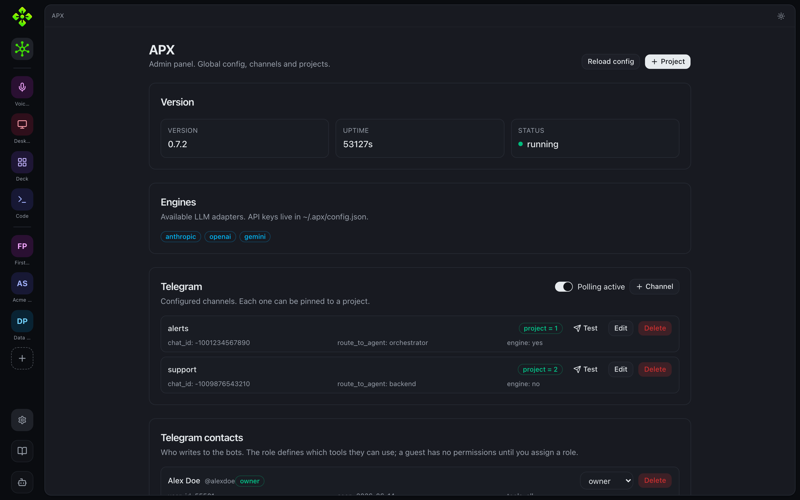

## Open on the local machine

The daemon serves the built panel at `http://127.0.0.1:7430/`. Start the daemon
and open that URL:

```bash
apx status          # boots the daemon if it isn't running yet
# then open http://127.0.0.1:7430 in your browser
```

On the first load the panel fetches its auth token automatically from
`/admin/web-token` (loopback-only endpoint). You don't need to copy a token
manually when opening from the same machine.

<Aside type="note">
  If the panel shows "The admin panel hasn't been built on this install", run
  `node scripts/build-web.js` (or `npm run build:web`) from the repo root to
  compile the bundle into `src/interfaces/web/dist/`.
</Aside>

## Open from another device (LAN pairing)

To open the panel on your phone or another computer on the same LAN, use
`apx pair web`. The command prints a QR code and a direct URL:

```bash
apx pair web
# Prints:
#   http://192.168.1.42:7430/#token=<token>
#   [QR code for scanning with a phone camera]
```

Scan the QR with your phone camera (no app needed) or share the URL. The
`#token=…` fragment carries the bearer token — the panel uses it automatically.

<Screenshot
  surface="terminal"
  caption="apx pair web — QR code and LAN link printed to the terminal"
  hint="Run: apx pair web" />

To see all currently paired clients or revoke one:

```bash
apx pair list
apx pair revoke <id>
```

<Aside type="caution">
  The daemon binds to `127.0.0.1` by default. For LAN access you need to opt
  in: `apx config set remote.bind 0.0.0.0` then restart the daemon. This is an
  explicit step so you don't accidentally expose the daemon on a shared network
  without intending to.
</Aside>

## Building the web bundle

The panel is a Vite + React + TypeScript app under `src/interfaces/web/`. The
built output lands in `src/interfaces/web/dist/` and is served by the daemon.

```bash
# Build once (from repo root)
node scripts/build-web.js

# Or rebuild manually
cd src/interfaces/web
pnpm install
pnpm build

# Development with hot reload (proxies API calls to :7430)
pnpm dev
```

The `build:web` npm script and the `prepack` hook both call
`node scripts/build-web.js`, so a global `npm install -g .` always ships a
fresh bundle. Set `APX_SKIP_WEB_BUILD=1` to skip it during dev flows that
don't touch the UI.

## Navigation model

The panel has two navigation levels:

- **Base** (`/p/0/…`) — the global daemon space: workspaces, models, sessions,
  logs, and global config. The chat in Base talks to the super-agent.
- **Project** (`/p/:pid/…`) — a single project workspace: agents, chat, tasks,
  routines, MCPs, memories, and config.

A left rail shows all registered projects plus module shortcuts (Voices, Desktop,
Deck, Code). Below the rail is a **Roby** button that opens a floating chat
sheet connected to the super-agent.

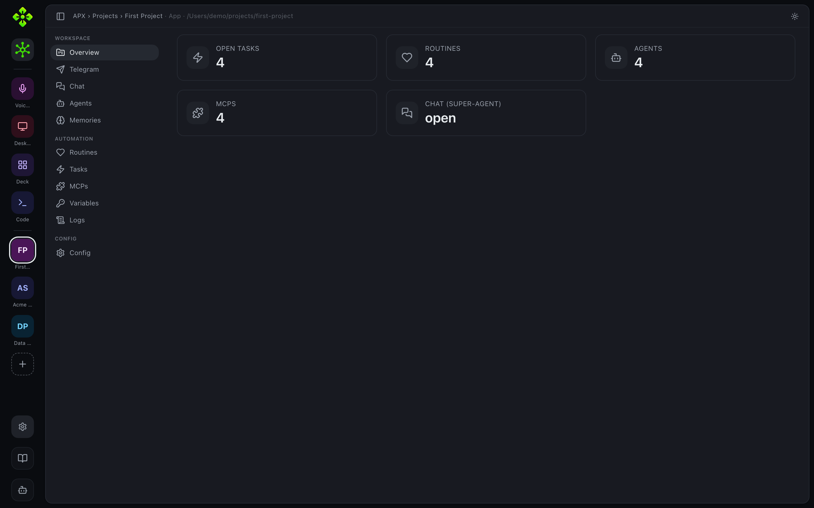

## Project workspace

Opening a project lands on its **Overview** with live counts and quick links into
every tab. Each tab below maps to a daemon API namespace.

### Chat

The **Chat** tab talks to the super-agent (Roby) and to each project agent. Every
thread is a live, in-memory session you can start, search, and branch from.

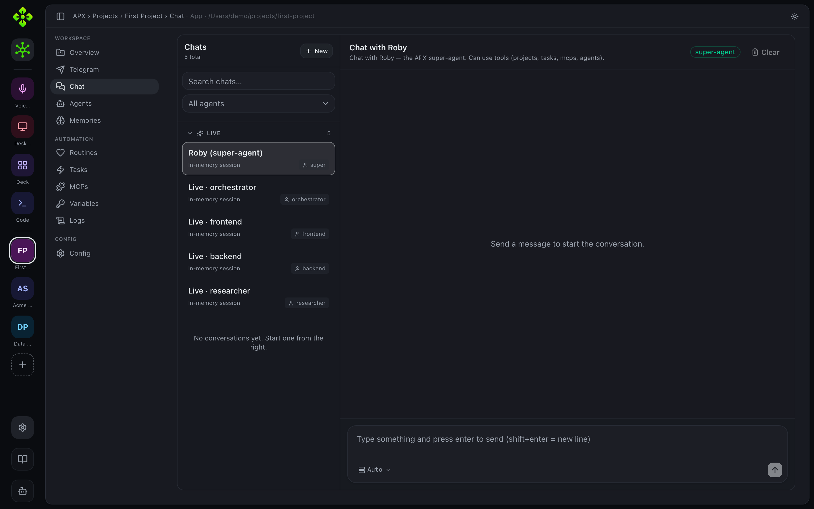

### Tasks

The **Tasks** tab is the project's backlog. Tasks carry an id, title, tags, due
date, and an assigned agent; they can be created from the web, the CLI, Telegram,
or by an agent itself.

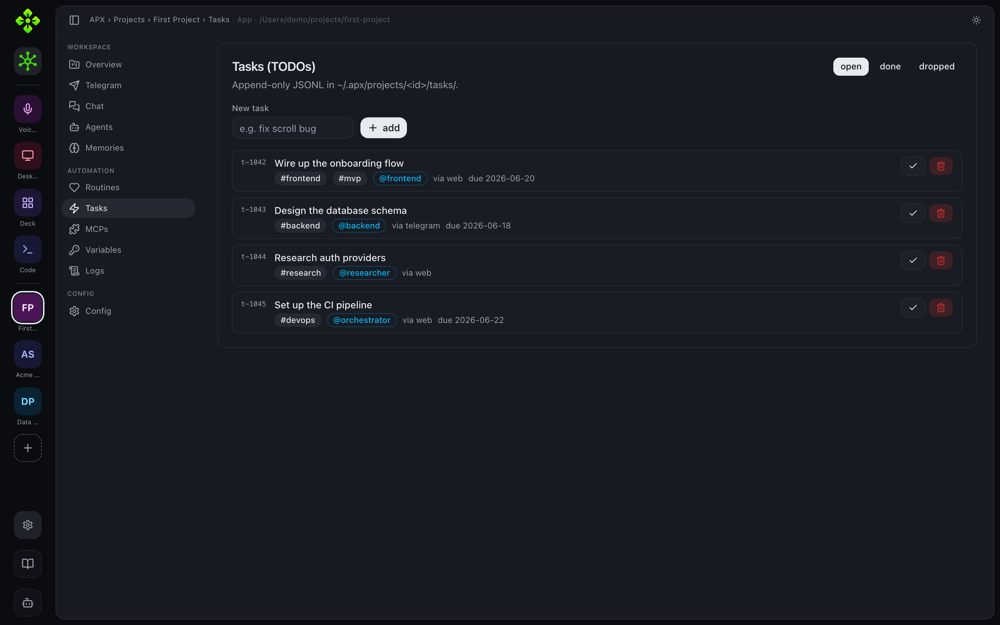

### Routines

The **Routines** tab schedules recurring work — a super-agent prompt, a shell
command, a Telegram message, or a heartbeat — on a cron expression.

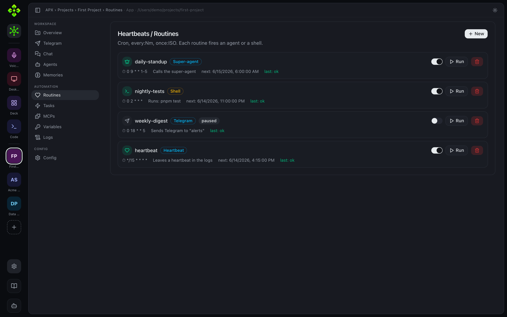

### MCPs

The **MCPs** tab lists the Model Context Protocol servers available to the
project across all three scopes (shared, runtime, global), with a live log pane.

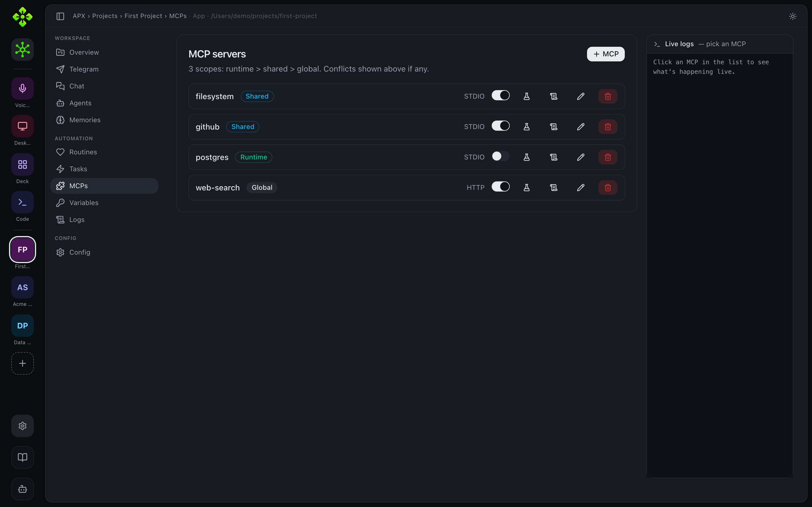

### Memories

The **Memories** tab edits the project's `.apc/memory.md` and each agent's
runtime memory, the long-lived context the agents read on every turn.

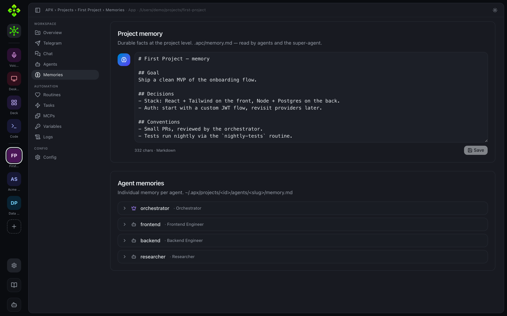

### Config

The **Config** tab shows the effective project configuration merged from the
project's `.apc/` files and the global defaults.

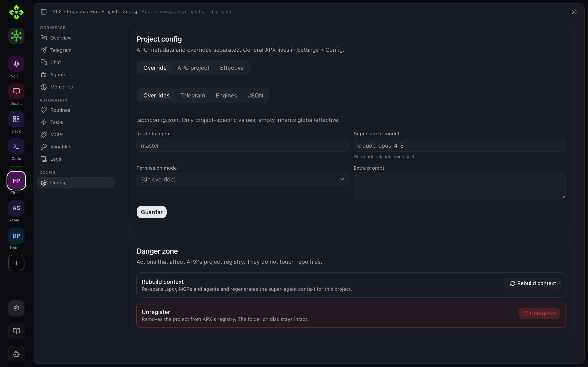

## Rail modules

### Projects

The Projects tab (Base → Workspaces) lists all registered projects as cards.
Click a card to enter that project. The "New project" button opens an inline
dialog (`?action=add-project`).

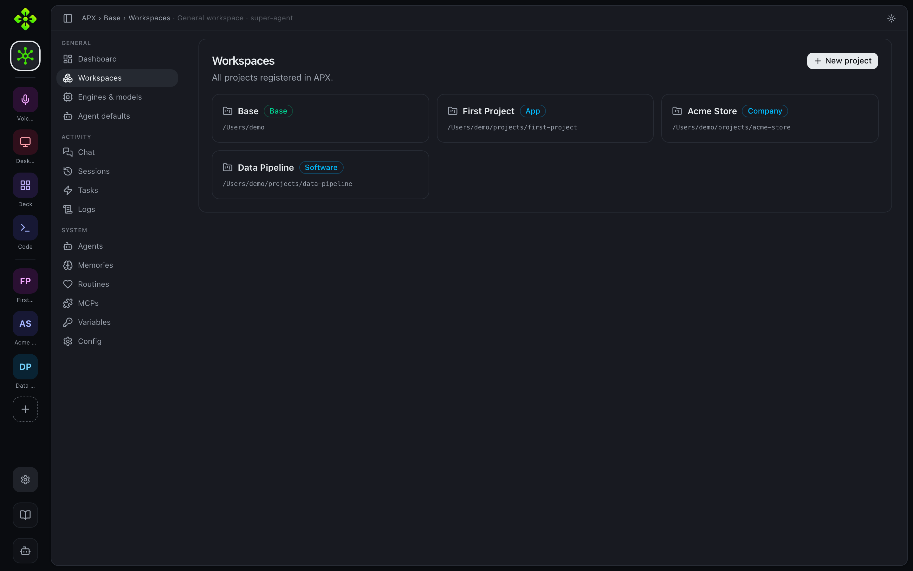

### Agents

Each project has an Agents tab. You can create, edit, and delete agents; view
and edit each agent's `memory.md`; and assign skills. In the Base space the
Agents tab shows the super-agent configuration (read-only summary).

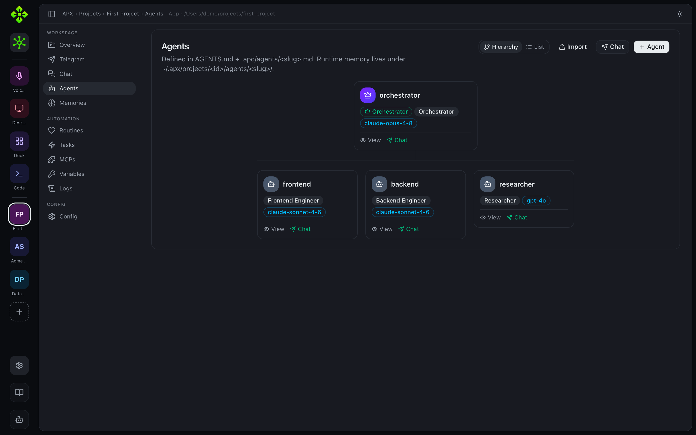

Open an agent to inspect its memory, skills, tools, sub-agents, and brain graph.

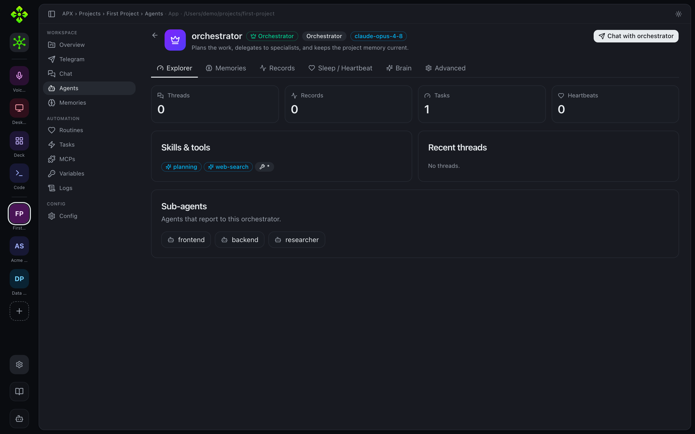

### Voices

The Voices module (`/m/voice`) configures TTS and STT globally. It shows the
live status of every configured TTS engine (Piper, ElevenLabs, OpenAI, Gemini,
mock), lets you pick a default or chain-with-fallback mode, reorder the chain,
configure per-engine credentials, and run a live test playback. The STT section
configures the Whisper model and language for mic input.

See [Voice](/apx/docs/surfaces/voice/) for the full CLI reference.

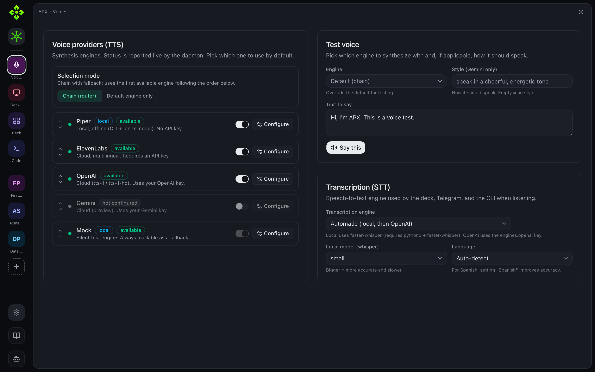

### Desktop

The Desktop module (`/m/desktop`) shows whether the floating Electron window is
running (connected WebSocket clients), lets you edit the global shortcut, and
toggle whether the daemon responds to desktop messages. You cannot start or stop
the Electron process from the web panel — use `apx desktop start / stop`.

See [Desktop](/apx/docs/surfaces/desktop/) for the full CLI reference.

### Deck <Badge text="Preview" variant="caution" />

The Deck module (`/m/deck`) will surface the `GET /deck/manifest` payload: daemon
health, active project, registered plugins, and the widget/desktop grid, and let
you enable or disable individual widgets from this view.

See [Deck](/apx/docs/surfaces/deck/) for the pairing CLI reference.

<Aside type="note">
  The Deck admin surface is a **demo for now** — the manifest view and widget
  grid are coming soon. The pairing CLI (`apx deck …`) is functional today.
</Aside>

### Code

The Code module (`/m/code`) is the admin surface for the APX coding assistant
(`apx code`). It lets you pick a project and inspect the tool trail from recent
sessions.

### Config

Global config lives under **Settings** (`/settings/*`). Sub-sections:

| Path | What it edits |
|---|---|
| `/settings/identity` | Assistant name, persona |
| `/settings/appearance` | Theme (light/dark) |
| `/settings/super-agent` | Super-agent model, system prompt, channels |
| `/settings/engines` | Model providers (add, edit, toggle) |
| `/settings/telegram` | Telegram bot token and channels |
| `/settings/devices` | Paired devices list |
| `/settings/advanced` | Raw `~/.apx/config.json` editor |

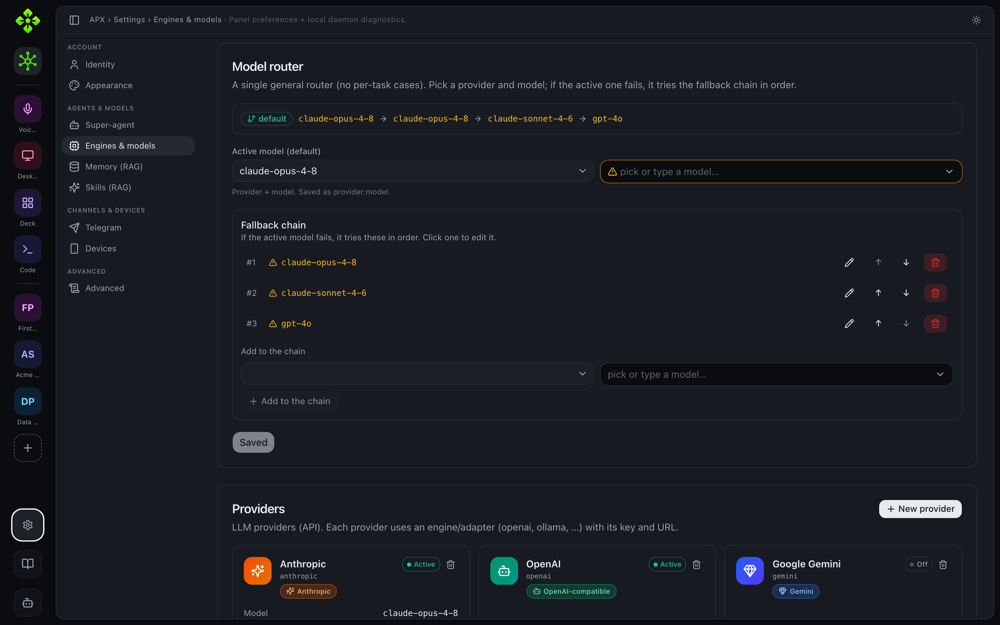

The **Super-agent** panel sets Roby's permission mode, personality, and system
prompt; the active model and fallback chain are configured in the model router.

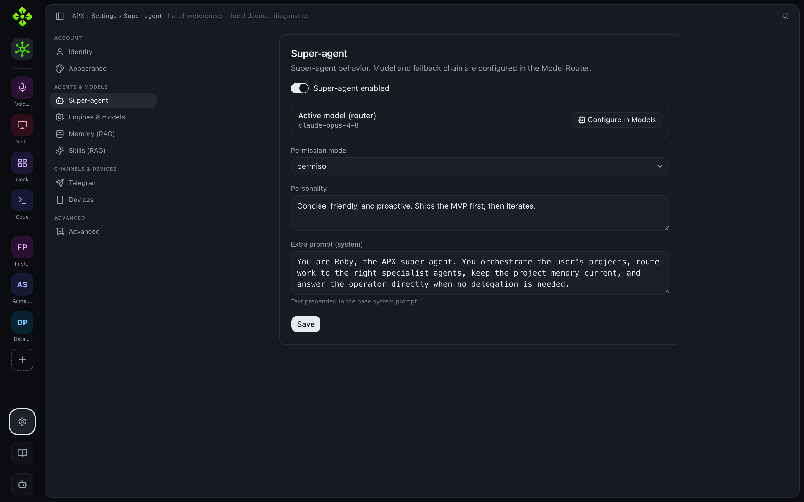

The **Telegram** panel manages the bot's channels, contacts, and per-role tool
permissions.

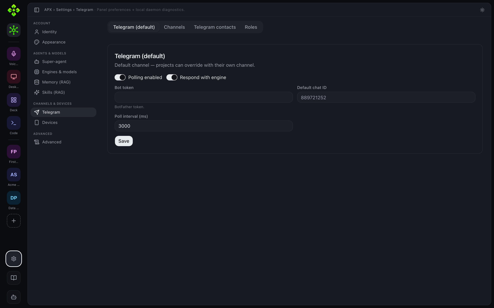

The **Devices** panel lists every paired browser or phone and lets you revoke a
token.

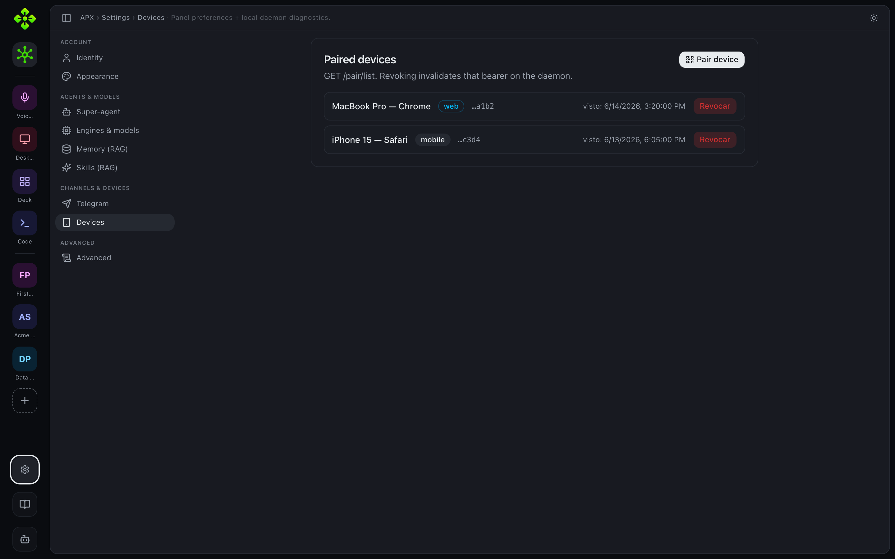

## Architecture

The panel is a thin client: it has no local state beyond the current session.
Every read is a GET against the daemon's HTTP API; every write is a PATCH or
POST. The daemon is the single source of truth.

```text
Browser  →  GET/POST  →  http://127.0.0.1:7430/<route>
                              ↓
                         APX daemon (host/daemon/)
                              ↓
                         core/ (logic, memory, agents…)
```

The web bundle is served by `src/host/daemon/api/web.js`. API routes always
take priority over the SPA catch-all, so a request to `/projects/1/agents` hits
the real endpoint, not `index.html`.

## Next steps

- [Desktop](/apx/docs/surfaces/desktop/) — the Electron floating window
- [Voice](/apx/docs/surfaces/voice/) — TTS/STT CLI and providers
- [Deck](/apx/docs/surfaces/deck/) — companion app pairing
